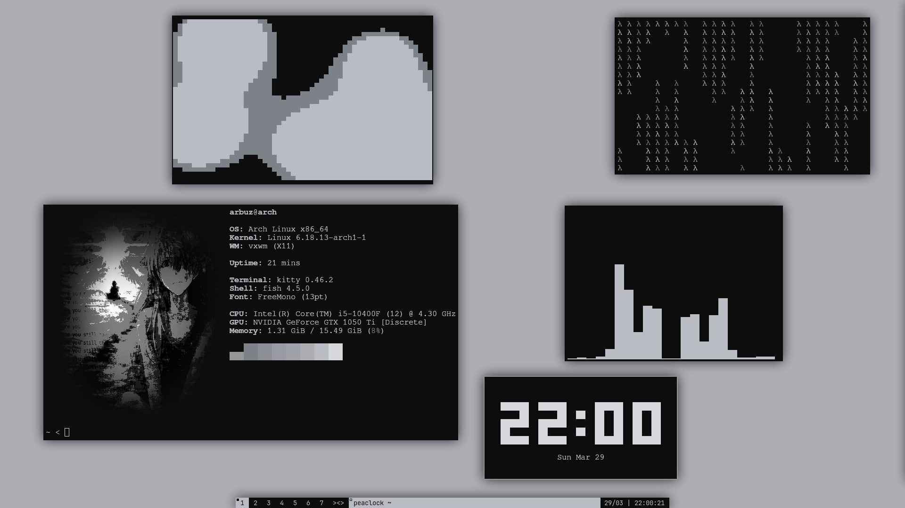

# My vxwm dotfiles 



## Installation

```bash
git clone https://github.com/talantvacheslav/dotfiles.git
cd dotfiles/
cp -rf config/* ~/.config/
cp -rf cache/* ~/.cache/
cp -rf xinitrc ~/.xinitrc
cd vxwm/
make clean
sudo make install
sudo cp -rf status.sh /bin/status.sh
```

## Usage

```bash
startx
```

## Stack

| Category | Tool |
|---|---|
| **WM** | vxwm (dwm fork) |
| **Compositor** | picom |
| **Terminal** | kitty |
| **Shell** | fish |
| **Launcher** | rofi |
| **Notifications** | dunst |
| **Wallpaper/Theme** | pywal, hsetroot |
| **Screenshot** | flameshot |
| **Monitor** | btop |
| **System Info** | fastfetch |
| **Browser** | Zen Browser |
| **File Manager** | nemo |
| **Messaging** | Discord, AyuGram (Telegram) |
| **Music** | Spotify, cava |
| **Clipboard** | cliphist, xclip |
| **Editor** | neovim |
| **Utils** | eza, stalonetray, xset, xinput, setxkbmap |

## Keybindings

All bindings use **Super** (`MOD4`) as the main modifier.

### Apps

| Binding | Action |
|---|---|
| `Super + R` | App launcher (rofi) |
| `Super + T` | Terminal (kitty) |
| `Super + W` | Browser (Zen) |
| `Super + E` | File manager (nemo) |
| `Super + D` | Discord |
| `Super + A` | Spotify |
| `Super + S` | Telegram (AyuGram) |
| `Super + V` | Clipboard history |
| `Super + Shift + S` | Screenshot (flameshot) |
| `Super + Shift + U` | System monitor (btop) |

### Window management

| Binding | Action |
|---|---|
| `Super + Q` | Close window |
| `Super + F` | Toggle fullscreen |
| `Super + J / K` | Focus next / prev window |
| `Super + Alt + Space` | Toggle floating |
| `Super + B` | Toggle bar |
| `Super + Shift + B` | Toggle bar position (top/bottom) |
| `Super + 1-7` | Switch to tag |
| `Alt + 1-7` | Send window to tag |
| `Super + Shift + , / .` | Focus prev / next monitor |
| `Super + Alt + , / .` | Send window to prev / next monitor |
| `Super + 0` | View all tags |
| `Super + Shift + 0` | Send window to all tags |
| `Super + Ctrl + 1-7` | Toggle view tag |
| `Super + Ctrl + Shift + 1-7` | Toggle tag on window |
| `Super + Shift + E` | Quit vxwm |

### Infinite canvas

| Binding | Action |
|---|---|
| `Super + Home` | Reset canvas to origin |
| `Super + Shift + Arrows` | Move canvas |
| `Super + Shift + LMB` | Move canvas(mouse) |
| `Super + Shift + C` | Center window |

### Directional focus

| Binding | Action |
|---|---|
| `Alt + Arrows` | Focus window in direction |
