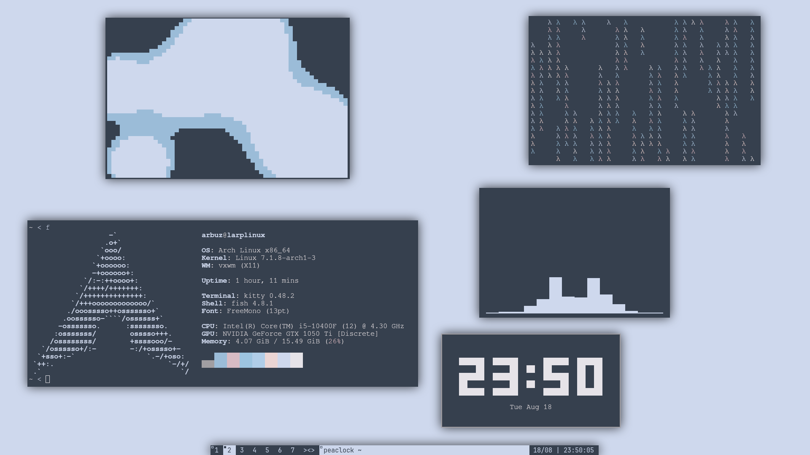

# My vxwm dotfiles 



## Installation

```bash
git clone https://github.com/talantvacheslav/vxwmdots.git
cd vxwmdots/

cp -rf config/* ~/.config/
cp -rf xinitrc ~/.xinitrc

cd vxwm/
make 
sudo make install

cd ..
cd scripts/
gcc zixclip.c -o zixclip -lX11 -lXfixes -lsqlite3 -lcrypto
```

## Usage

```bash
startx
```

## Dependencies
libx11 libxft libxinerama pywal picom rofi dunst flameshot

kitty fish nemo firefox AyuGram discord 

## Applications binds

`super+e` nemo

`super+t` kitty

`super+w` firefox

`super+s` ayugram

`super+d` discord

`super+a` spotify

`super+shift+s` flameshot


#### see another binds in config.def.h

